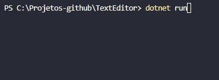

<h1 align="center">Editor de Textos 📑</h1>

  

## :books: Informações
Primeira versão do meu projeto "Editor de Textos em C#", o qual a aula foi orientada pelo Andre Baltieri. Neste projeto aprendi mais sobre o uso do "StreamReader" para leitura de arquivos e a importância de fechar os arquivos.

## :pushpin: Tecnologias
<ul>
  <li><a href="https://docs.microsoft.com/pt-br/dotnet/csharp/programming-guide/">C#</a></li>
</ul>
